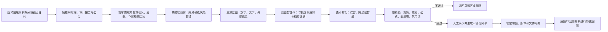

# 审迹智链（AuditTrace）详细项目计划书

> **正式题目建议：**《审迹智链（AuditTrace）——基于证据约束与反证挑战的上市公司收入确认重大错报风险预筛查智能体》  
> **版本：**V1.0·风险控制版  
> **日期：**2026年7月15日  
> **用途：**团队执行、指导老师审阅及初赛《项目方案书》撰写底稿

## 一、项目结论与总体策略

### 1.1 项目结论

团队拟选择“财务舞弊对抗刺探”方向，但不直接开发一个自动判断企业是否舞弊的系统，而是将项目收窄为：

> **在业务承接、续约和审计计划开始前，利用上市公司已经公开的资料，发现收入确认相关的重大错报风险线索；系统主动寻找正常商业解释，检查证据是否充分，最后输出可追溯、可人工复核的审计任务卡。**

这个调整保留了“质疑—反证—裁判”的技术亮点和现场记忆点，同时降低以下风险：

- AI对特定公司作出未经核实的负面评价；
- 多智能体自由争论导致输出不稳定；
- 仅凭几个异常指标便直接认定舞弊；
- 用处罚决定倒推答案，形成“事后诸葛亮”；
- 项目范围过大，最终只能做成概念演示。

### 1.2 正式标题为何不使用“主动刺探舞弊”

“主动刺探”可作为项目内部的创意表达，但不建议出现在正式题目和界面结论中。正式标题使用“收入确认重大错报风险预筛查”，原因是：

- 更符合审计业务中的风险评估定位；
- 公开资料只能支持发现风险线索，不能代替合同、函证、银行流水等内部取证；
- 竞赛手册第6.2.3条明确要求避免对特定上市公司、个人作出未经核实的负面评价；
- 能把伦理限制转化为“证据约束、可解释、人工复核”的产品亮点。

### 1.3 一句话创新主线

> **系统不是让三个AI自由争论，而是让风险假设依次通过三源互证、强制反证、证据硬校验和人工确认，再用不偷看答案的历史回测证明效果。**

## 二、竞赛要求与本项目回应

根据[竞赛手册](../../../附件1北京市大学生数智会计创新应用竞赛手册.docx)，作品必须使用大语言模型作为核心推理引擎、输出结构化结果、提供可演示原型，并满足数据来源和伦理合规要求。初赛方案书要求10—15页，介绍视频不超过5分钟。

| 评审维度 | 本项目主要设计 | 最终给评委看的证据 |
|---|---|---|
| 专业深度（25分） | 围绕收入确认，将异常连接到应收账款、合同资产、存货与成本、经营现金流、管理层认定和审计程序 | 风险规则卡、证据链、管理层认定、审计任务卡 |
| 技术创新（25分） | 三智能体结构化协作、证据硬门槛、三源互证、反证挑战、多期轨迹 | 工作流画面、缺证据自动拦截、反证前后结果对比 |
| 落地可行（20分） | 仅使用公开资料进行业务承接前预筛查；范围锁定为两家公司、三年、三类收入风险 | 可运行Web原型、固定案例、导出报告、用户操作说明 |
| 效果评估（15分） | T0/T1监管时点隔离回测，并与固定规则、通用大模型进行等条件对比 | 文件日期日志、回测对照表、引用准确率、覆盖数量和稳定性 |
| 文档展示（10分） | 一条风险从数字异常一直展开到原文、反证、裁决和核查程序 | 方案书、架构图、演示脚本、5分钟视频和备用录屏 |
| 伦理合规（5分） | 案例脱敏、AI声明、禁止定性词、来源白名单、人工确认后才能导出 | 合规页面、禁用词测试、数据来源台账和免责声明 |

## 三、问题定义、用户和应用场景

### 3.1 现实问题

会计师事务所在承接客户、决定是否续约或制定审计计划时，需要快速阅读多年度年报、审计报告、公告和监管文件。仅依靠人工存在三个问题：

1. 多年度、跨文件的数字和说法很难同时对照；
2. 普通财务比率只能提示异常，不能说明异常来自哪里、是否有正常解释；
3. 通用大模型可能给出看似专业但无法回查原文、页码和计算过程的结论。

### 3.2 目标用户

- 会计师事务所的项目承接、续约和审计计划人员；
- 企业内部审计或风险管理人员；
- 高校审计案例教学人员。

### 3.3 系统输出

系统不输出“企业是否舞弊”，而是输出不超过5条的结构化风险任务卡，每条包括：

- 风险假设；
- 支持证据及原文页码；
- 涉及数字、单位和计算公式；
- 财务报表项目和管理层认定；
- 可能的正常商业解释；
- 反证挑战结果；
- 证据闭合度；
- 当前证据缺口；
- 建议执行的审计程序；
- 人工确认状态。

## 四、第一版范围：必须锁到足够小

### 4.1 第一版只做什么

| 范围项目 | 第一版锁定内容 |
|---|---|
| 业务主题 | 上市公司收入确认重大错报风险预筛查 |
| 重点旁证 | 应收账款/合同资产、存货/营业成本、经营活动现金流 |
| 风险类型 | 虚假贸易或缺乏商业实质、总额法与净额法不当、收入确认时点异常 |
| 公司数量 | 2家已有正式监管结论的历史案例公司，界面统一显示“案例A”“案例B” |
| 时间跨度 | 每家公司连续3个年度，共6个公司年度切片 |
| 资料类型 | 年报、审计报告、公开公告；回测答案另存问询函、回复、更正和最终处罚文件 |
| 正式输出 | 每家公司最多5条风险任务卡 |
| 演示方式 | 内置两套已预处理案例，同时允许上传符合模板的样例Excel/PDF |

### 4.2 第一版明确不做什么

- 不做全市场自动扫描；
- 不做所有财务舞弊类型；
- 不做合同、发票、银行流水真实性鉴定；
- 不做客户供应商全网关系图谱；
- 不输出精确“舞弊概率”；
- 不自动作出审计意见或监管认定；
- 不承诺任意格式、任意公司的PDF均能完全自动解析；
- 不在现场临时分析未经过资料合规检查的真实公司。

### 4.3 案例选择门槛

两家案例必须满足：

1. 至少有一家公司已经存在正式公开的监管结论；
2. 能取得监管关注前连续3年的原始年报；
3. 处罚或问询中涉及收入确认，且在此前公开资料中存在可观察线索；
4. 官方PDF、披露日期和来源链接完整；
5. 两家公司尽量代表不同难度：一家公司风险信号明显，另一家公司存在较强正常解释；
6. 界面和视频中默认脱敏，真实名称仅在“官方历史案例来源说明”附录中出现。

当前可优先核查龙宇股份、金通灵、卓朗科技等历史案例，但必须经过第一周的数据完整性测试后，再由指导老师确认最终两家，不能只因为案件知名就直接选定。

两家公司是产品开发和现场展示的固定范围。效果评估如在第8周前资料准备充分，可额外加入4个同行业、相近规模和相近年度的轻量观察样本，只用于检验系统是否产生过多无依据警报，不为这些样本开发新功能；若无法完成可靠匹配，则不计算传统“误报率”，如实将研究定位为历史案例验证。

### 4.4 范围失控的停止规则

任何新功能必须同时满足“直接服务收入风险、两周内能完成、有可测验收指标”三个条件，否则进入“晋级后扩展清单”，不得加入第一版。

## 五、五项核心创新如何嵌入系统

### 5.1 创新一：证据硬准入门槛

每条线索必须同时具备文件名、披露日期、PDF页码、印刷页码、原文、财务数字、公式、管理层认定、正常解释、缺失证据和建议程序。印刷页码允许由队员人工确认后锁定。

系统采用两层裁决：

- **语义裁判智能体**检查原文是否真正支持结论、措辞是否过度；
- **确定性硬校验程序**检查页码是否存在、原文能否在对应页找到、公式能否复算、必填字段是否缺失、是否出现禁用词。

AI裁判不能绕过硬校验。缺项结果只能留在草稿区，不能进入正式报告。

### 5.2 创新二：三源互证与证据闭合度

系统把证据分为：

1. 财务数据源：收入、应收账款、合同资产、存货、成本、现金流等；
2. 披露描述源：收入政策、业务模式、结算方式、主要责任人与代理人判断等；
3. 外部佐证源：分析截止日前已经公开的公告、行业数据和监管关注材料。

三类均支持时标记为“高闭合度”；两类支持时标记为“中闭合度”；只有单项异常时仅作“观察项”；来源互相矛盾时转入人工复核。闭合度只表示证据完整程度，不等同于舞弊概率。

### 5.3 创新三：强制反证挑战

保留“质疑—辩护—裁判”的可视化形式，但改成一次固定、结构化的反证流程：

- 质疑智能体提出风险假设；
- 反证智能体必须从允许使用的资料中寻找至少一种正常解释；
- 语义裁判判断风险应当保留、降级还是暂缓；
- 硬校验程序进行最后准入；
- 人工复核者决定是否正式导出。

反证智能体不能凭空编解释。每个正常解释也必须附出处；找不到依据时，只能写“待验证解释”。

### 5.4 创新四：多期风险轨迹与可解释分层归因

系统连续比较3个年度，将风险轨迹分为：

- 单年偶发；
- 连续存在；
- 逐年恶化或加速；
- 已有改善但可持续性待观察。

归因只列出有证据支持的候选解释：行业周期、正常经营调整、需要进一步核查的人为操纵风险。每个候选解释分别展示支持证据、反对证据和缺失证据，不把相关关系包装成已经证明的因果关系。

### 5.5 创新五：监管时点隔离回测

为每个案例设置分析截止日T0：

- `T0_ANALYSIS`只存放截止日前可公开取得的材料；
- `T1_ANSWER_LOCKED`存放后续问询、回复、更正、立案和处罚文件；
- 系统运行时记录实际读取文件清单、披露日期和文件哈希；
- 先锁定系统输出，再由负责回测的队员解锁T1答案并逐项对照。

这样证明系统是在“不偷看答案”的情况下发现风险，而不是让大模型复述处罚决定。

## 六、完整业务与技术流程



### 6.1 三智能体的稳定化设计

| 模块 | 固定输入 | 固定输出 | 禁止事项 |
|---|---|---|---|
| 质疑智能体 | 已校验财务指标、T0原文片段、风险规则卡 | 风险假设、支持证据、涉及认定 | 不得直接写“企业造假”，不得自行编数字 |
| 反证智能体 | 风险假设、同一T0资料、正常解释清单 | 正常解释、支持/反对证据、仍缺材料 | 不得使用T1答案，不得无来源辩解 |
| 语义裁判 | 双方结构化结果、证据字段 | 保留/降级/暂缓及原因 | 不得绕过程序硬校验，不得成为最终人工结论 |

不进行无限轮辩论，不公开不可验证的长篇“思维过程”，只展示证据、判据和结构化决策记录。

### 6.2 硬校验和人工复核

数字计算、单位换算、期间对比、页码范围、必填字段、禁用词和文件日期全部由程序检查。最终导出必须由人工勾选“接受、修改、删除”之一，系统保存修改人、时间和修改内容。

## 七、数据、案例和标签方案

### 7.1 官方来源白名单

- 巨潮资讯网的原始年报和公告；
- 中国证监会及各地证监局的正式监管文件；
- 上海、深圳、北京证券交易所的问询函和公告；
- 财政部、中国注册会计师协会发布的会计与审计准则；
- 具有明确日期、口径和来源的同行业公开数据。

不把自媒体文章、无来源转载或未经许可的批量爬取数据作为核心证据。每份文件登记原始链接、披露日期、下载日期、文件哈希和使用权限说明。

### 7.2 每家公司需要整理的字段

- 营业收入、营业成本和毛利率；
- 应收账款、合同资产、合同负债及坏账准备；
- 存货、存货跌价准备和存货周转；
- 经营活动现金流量净额、销售商品收到的现金；
- 分产品或分行业收入与毛利率；
- 前五大客户和供应商集中度；
- 收入确认政策、总额法/净额法、主要责任人判断；
- 审计意见、关键审计事项、内控意见和事务所变更；
- 文件来源、披露日期、PDF页码和印刷页码。

### 7.3 标签必须分层

| 标签 | 含义 | 是否可以称为舞弊 |
|---|---|---|
| 最终监管认定 | 最终处罚文件已经明确认定 | 只可在T1回测对照页准确引用官方表述 |
| 监管关注 | 交易所发出问询或监管工作函 | 不可以，问询不等于认定 |
| 差错更正 | 公司更正财务信息 | 不可以，差错不必然是故意舞弊 |
| 非标审计意见 | 审计证据或报表存在重大问题 | 不可以，不等于监管认定舞弊 |
| T0风险线索 | 系统基于当时公开资料提出待核查事项 | 不可以，只能称风险线索 |
| 观察窗口未见认定 | 截止观察日未发现公开最终认定 | 不可称为“正常公司” |

### 7.4 文件隔离结构

```text
competition_project/
├─ 00_management/             # 任务、周报、会议记录
├─ 01_rules/                  # 会计规则、正常解释和审计程序
├─ 02_cases/
│  ├─ case_A/
│  │  ├─ T0_ANALYSIS/         # 模型允许读取
│  │  └─ T1_ANSWER_LOCKED/    # 回测前禁止读取
│  └─ case_B/
├─ 03_evidence_index/         # 原文、双页码、数字和来源台账
├─ 04_app/                    # 程序、提示词和配置
├─ 05_tests/                  # 基线、回归、稳定性和合规测试
├─ 06_documents/              # 方案书、技术报告、PPT
└─ 07_demo_backup/            # 缓存结果和备用录屏
```

答案区由回测负责人保管；队长开发时优先使用人工制作的规则接口和匿名标签，不提前读取监管答案正文。

## 八、技术方案与Vibe Coding方式

### 8.1 建议技术栈

| 层级 | 建议工具 | 作用 |
|---|---|---|
| 开发方式 | Trae/Codex辅助Vibe Coding | 用自然语言生成、解释和修改代码，保留提示词与迭代记录 |
| Web原型 | Streamlit，必要时辅以少量前端组件 | 快速实现上传、风险卡、趋势图、人工确认和导出 |
| 运行底座 | Python 3.10+ | 满足手册要求，负责数据读取、确定性计算、校验和接口调用 |
| 数据处理 | pandas、PyMuPDF/pdfplumber | 处理表格、PDF页码和原文定位 |
| 结构校验 | Pydantic/JSON Schema | 固定智能体输入输出，拦截缺字段结果 |
| 智能体 | Coze工作流或本地状态机＋国产大模型API | 完成质疑、反证和语义裁判 |
| 存储 | SQLite＋本地文件清单 | 保存案例、证据、运行日志、人工修改和版本 |
| 版本与密钥 | Git＋`.env`＋`.env.example` | 版本回退、隐藏API密钥和复现环境 |

ChatGPT会员仅用于队长辅助研究和开发，不等于可供产品调用的API。作品运行模型必须在第三周前确定，并优先准备DeepSeek、通义千问或组委会支持的模型接口。

### 8.2 Vibe Coding的证明材料

- 每项功能的自然语言需求；
- AI生成或修改代码的记录；
- 修改前后的运行截图；
- 报错、原因、修复和回归测试；
- Git版本号和可运行发布包；
- 另一台电脑从零安装和启动的录屏。

项目不是提交一个传统Python脚本或Notebook，而是提交完整Web工作流；同时按手册准备`requirements.txt`、中文关键注释、`.env.example`和一键启动说明。

### 8.3 原型页面

1. 案例选择、T0截止日和AI免责声明；
2. 输入资料清单、日期和关键数字人工确认；
3. Top-5风险总览与三年轨迹；
4. 单条风险证据链与三源闭合度；
5. 质疑—反证—裁判的结构化对照；
6. 硬校验结果、人工接受/修改/删除；
7. 审计任务卡导出；
8. T1解锁后的历史回测对照页。

## 九、效果评估方案

### 9.1 对比基线

在相同资料、相同模型和相近调用成本下比较：

- **B0：**固定财务比率和规则；
- **B1：**通用大模型直接阅读年报并回答；
- **B2：**单智能体＋结构化证据模板；
- **B3：**完整系统，即质疑＋反证＋语义裁判＋硬门槛＋人工确认。

若完整系统不能稳定优于B2，就删减无贡献的智能体节点，不为了展示而保留冗余角色。

### 9.2 核心指标与内部目标

| 指标 | 计算方式 | 内部目标 |
|---|---|---:|
| 数字复算准确率 | 与人工Excel核对正确数字/总数字 | 100% |
| 引用页码准确率 | 原文和页码均正确的引用/抽查引用 | 测试集≥98%，正式演示卡100% |
| 无依据高风险输出 | 通过硬门槛但无来源支持的高风险条数 | 0条 |
| 反证覆盖率 | 包含至少一种正常解释的正式风险/全部正式风险 | 100% |
| AI声明覆盖率 | 带“AI 生成、不构成专业结论”声明的正式页面和导出报告/全部正式输出 | 100% |
| T0/T1泄漏 | 分析日志中读取截止日后文件数量 | 0份 |
| Top-5监管事项覆盖 | T0可观察且被系统发现的后续监管事项/可观察事项 | 目标≥70%，同时报告具体分子和分母 |
| 完整流程成功率 | 固定案例连续运行20次的成功次数 | ≥19/20 |
| 重复运行稳定性 | 20次运行中核心风险类型保持一致的比例 | ≥90% |
| 审计任务可执行性 | 指导老师按5分制评价 | ≥4分 |
| 固定案例处理时间 | 已预处理案例从启动到结果 | ≤3分钟 |

由于只有少量历史案例，不宣传“适用于全部上市公司的准确率”。没有被处罚也不等于没有舞弊，因此对观察样本只报告“产生了几条有证据风险”和“无依据输出数量”，不把它简单计算成传统误报率。

评估样本分为两层：第一层是两家主案例连续3年的6个公司年度切片；第二层是有条件时加入的4个匹配观察样本。所有结果必须同时报告分子和分母，不使用一个漂亮百分比掩盖小样本限制。

### 9.3 回测防泄漏措施

- 按实际披露日期过滤文件；
- T0与T1物理分文件夹并记录读取日志；
- 运行前隐藏公司名称和代码，统一替换为案例A/B；
- 回测运行时关闭互联网搜索和外部检索工具，只允许模型使用T0输入库；
- 优先使用较新、较少被模型记忆的案例；
- 输出锁定后再打开监管答案；
- 由老师临时加入1—2个未知数据错误进行额外盲测。

## 十、伦理、技术和项目风险控制

### 10.1 风险登记表

| 风险 | 触发信号 | 预防措施 | 失败时备用方案 | 负责人 |
|---|---|---|---|---|
| 未经核实的负面评价 | 页面出现“造假、虚构、欺诈、实锤”等定性词 | 案例脱敏、禁用词扫描、人工确认、固定免责声明 | 删除定性内容，只保留“待核查风险线索” | 队长＋C |
| AI编造数字或页码 | 数字无法复算、原文在对应页找不到 | 数字由程序计算；双页码；原文字符串和页码硬校验 | 改用人工确认后的结构化证据，不进行全自动PDF引用 | 队长＋A |
| 多智能体输出不稳定 | 同一案例多次运行结论大幅变化 | 固定JSON、低随机性、单轮挑战、固定证据集 | 去掉AI裁判，保留程序硬门槛和人工裁决 | 队长 |
| 回测偷看答案 | T0日志出现T1文件或处罚后的信息 | 物理隔离、日期过滤、文件哈希、B保管答案 | 作废该轮结果并重新建立干净环境 | B |
| 大模型记住知名案例 | 隐去T1后仍直接说出公司和处罚事实 | 公司名代码脱敏、选较新案例、限制模型只引用输入 | 加入老师临时设计的未知异常作为第二验证 | B＋队长 |
| 公开资料不足 | 无法取得连续年报、双页码或目标事项没有前期信号 | 第一周设案例准入门槛，准备3—4家候选 | 更换案例；必要时只做一家公司＋同公司多年度 |
| PDF表格错位或单位错误 | 同一数字在不同页面提取结果不一致 | 人工确认关键数字、保存单位和口径、自动勾稽 | 比赛输入改用已核对Excel，PDF只承担证据展示 | A＋B |
| 样本过小却夸大结论 | 计划书出现“准确率代表全部市场”等说法 | 使用案例验证措辞，所有比例同时列分子分母 | 删除泛化结论，只报告样本内结果和失败案例 | B＋C |
| 只选处罚案例导致无法观察过度预警 | 所有测试样本都来自已处罚公司，却宣传“误报率低” | 有条件时加入4个匹配观察样本；区分监管确认、监管关注和观察窗口未见认定 | 未完成可靠匹配时不计算传统误报率，只报告无依据输出数量 | B＋A |
| 监管问询被误当舞弊标签 | 把问询函直接标为“舞弊公司” | 标签分层，问询只代表监管关注 | 重新标注并修订评估结果 | A＋B |
| 网络/API现场故障 | 模型超时、限流或平台不可用 | 缓存两套案例、超时重试、本地规则可独立运行 | 切换缓存结果并播放备用录屏，明确说明 | 队长 |
| GPT会员与运行接口混淆 | 原型只能在队长聊天窗口中运行 | 第三周前确定国产模型API；GPT仅用于开发 | 使用Coze或组委会支持接口；保留本地静态演示 | 队长 |
| 未经许可抓取、来源不清或组件授权遗漏 | 文件没有官方链接和来源台账，或未记录开源组件许可证 | 只使用来源白名单；保存MANIFEST、下载日期和开源许可证清单 | 删除无法说明来源的数据或替换组件 | B＋C |
| API密钥或个人信息泄漏 | 密钥进入代码、截图或提交包 | `.env`、提交前密钥扫描、不收集个人敏感信息 | 立即吊销密钥并更换；重新生成提交包 | 队长 |
| 功能持续增加 | 每周加入与收入风险无关的新模块 | 范围冻结，新想法进入扩展清单 | 删除关系图谱、OCR和非核心图表 | 队长 |
| 队员任务过难 | 连续一周只有“学习中”而没有文件交付 | 任务模板化、队长给示例、每周中期检查 | 缩减数量并把复杂技术工作收回队长 | 队长 |
| 现场操作复杂 | 5分钟无法走完闭环 | 固定一条主风险，按钮和步骤不超过7次 | 使用标准演示模式和2分钟备用录屏 | C＋队长 |

### 10.2 页面统一用语

允许使用：

- “待核查风险线索”；
- “财务数据与披露文字存在不一致”；
- “公开资料不足以排除正常解释”；
- “建议追加审计程序”；
- “本结果由AI 生成，不构成审计、投资或监管结论”。

禁止使用：

- “该公司已经造假/舞弊”；
- “实锤虚构收入”；
- “管理层故意欺骗”；
- “该客户属于配合造假方”；
- 任何没有正式监管文件支持的违法犯罪定性。

只有在T1历史回测页引用最终监管文件时，才可准确转述官方已经认定的事实，并必须同时显示文件名称、日期和链接。

### 10.3 三条不可退让的红线

1. 没有原文、页码和可复算数字的风险，不得进入正式报告；
2. 系统只能判断证据是否足以形成待核查线索，不能判断企业是否已经舞弊；
3. 历史回测必须隔离分析时点之后的答案材料，发现泄漏即作废该轮结果。

### 10.4 关键降级门槛

- 第5周引用准确率仍低于90%：停止追求任意PDF自动解析，改用人工确认后的证据索引；
- 第7周三智能体重复运行稳定性低于80%：取消AI裁判的最终决定权，改为程序硬门槛＋人工裁决；
- 第8周找不到至少两项T0可观察且能与T1对照的监管事项：更换案例或进一步收窄题目；
- 现场单次运行超过3分钟或接口频繁失败：演示使用预处理案例和缓存，不临时上传未知公司；
- 9月10日后不增加新功能，只修复错误、补测试和完善材料。

## 十一、四人团队职责

### 11.1 队长：AI工作流、Vibe Coding、系统整合与项目管理

**目标：**把三名队员提供的专业规则、证据和测试整合成一个稳定、可解释、可回测的Web原型。

主要任务：

- 使用Trae/Codex进行Vibe Coding，建立并维护Web原型；
- 搭建质疑、反证和语义裁判工作流；
- 编写确定性财务计算、证据门槛、日期过滤和禁用词校验；
- 实现多期趋势、风险卡、人工确认、导出和回测页面；
- 管理模型接口、`.env`、代码版本、运行日志和备份；
- 每周发布任务，验收三名队员文件并完成系统整合；
- 准备断网、API失败和演示超时备用方案。

每周必须提交给团队：

- 一个带版本号的可运行版本；
- 1—2分钟运行录屏；
- Vibe Coding日志和本周修改清单；
- 已修复问题、未解决问题和下周接口需求；
- 完整备份及回退版本。

软件与最低技能：Trae/Codex、Coze、Python 3.10+、Streamlit、Git、Office/WPS、浏览器；会描述需求、运行程序、复制报错、测试修改、保存版本和隐藏密钥，不要求完全手写全部代码。

### 11.2 队员A：会计审计规则、证据与专业复核

**目标：**保证系统每条风险在会计和审计上说得对，并能转化为具体核查程序。

主要任务：

- 整理6—8张收入风险规则卡；
- 为每条规则写清指标、公式、管理层认定和正常解释；
- 整理收入政策、业务模式、关键审计事项和三年变化原文；
- 建立双页码证据索引并保存原文上下文；
- 为每条风险编写可执行的审计程序；
- 逐条复核系统数字、页码、措辞和专业判断。

每周必须提交给队长：

- 新增或修订的风险规则卡；
- 原始PDF/官方链接、双页码和截图；
- 本周AI结果专业复核表；
- 至少5条已核对结论或队长指定的复核数量；
- 发现的专业错误和修改建议。

软件与最低技能：Excel/WPS、Word/WPS、PDF阅读器、浏览器和截图工具；会计算增长率与周转指标，理解发生、截止、准确性、完整性等认定，能区分异常线索和最终认定，不要求写代码。

### 11.3 队员B：案例数据、T0/T1隔离与效果评估

**目标：**证明系统不是复述答案，而是在相同资料下比固定规则和通用AI更可靠。

主要任务：

- 整理候选案例资料、披露日期、官方来源和文件哈希；
- 建立两家公司三年的关键财务数字表；
- 建立T0分析区和T1答案区，负责回测前答案保管；
- 把后续问询和处罚事项整理成人工参考答案；
- 运行B0—B3基线，对比覆盖、引用、无依据结论、时间和稳定性；
- 保存每次测试的输入、版本、实际输出、错误截图和复测结果。

每周必须提交给队长：

- 至少一个公司年度资料包或指定数量的数据表；
- 来源台账和日期核对表；
- 人工参考答案或测试记录；
- 指标统计和失败样例；
- T0/T1泄漏检查结果。

软件与最低技能：Excel/WPS、PDF阅读器、浏览器、文件压缩工具；会录入和筛选数据、统一单位、计算同比、整理时间线和按测试步骤复现问题，不要求开发算法。

### 11.4 队员C：产品易用性、伦理合规、计划书与视频

**目标：**让评委在5分钟内看清项目边界、五项创新、完整证据链和量化效果。

主要任务：

- 设计8个核心页面的草图、文字和操作顺序；
- 负责案例脱敏、AI声明、禁用词和数据来源展示；
- 邀请非项目成员试用，记录看不懂、点错和找不到的地方；
- 维护计划书、PPT、视频分镜、解说词和来源附录；
- 检查程序、计划书、PPT和视频中的名称、数字、口径是否一致；
- 准备5分钟介绍视频和断网备用录屏。

每周必须提交给队长：

- 最新页面草图或截图；
- 合规检查表和禁用词扫描结果；
- 最新计划书/PPT/讲解稿；
- 至少3条用户反馈及修改建议；
- 中期开始每周提交1—3分钟试讲或录屏。

软件与最低技能：PowerPoint/WPS、Word/WPS、剪映、浏览器、截图工具，Canva可选；会画页面草图、统一排版、录屏剪辑、压缩表达和核对合规用语，不要求独立编程。

### 11.5 责任矩阵

| 工作 | 队长 | A | B | C |
|---|---|---|---|---|
| 范围和最终决策 | 主责 | 会签 | 会签 | 会签 |
| 会计规则与审计程序 | 整合 | 主责 | 协助测试 | 通俗化表达 |
| 案例和证据索引 | 系统接入 | 主责复核 | 主责收集 | 来源展示 |
| T0/T1回测 | 技术实现 | 专业对应 | 主责 | 报告呈现 |
| AI工作流和Web原型 | 主责 | 内容复核 | 测试 | 页面验收 |
| 伦理合规 | 技术拦截 | 专业措辞 | 标签检查 | 主责统检 |
| 方案书、PPT和视频 | 总审 | 专业章节 | 评估章节 | 主责制作 |

## 十二、十周执行安排

> 竞赛手册把方案书提交与原型评审安排得非常接近，因此不能等9月25日后才开始开发。团队内部目标为：**8月31日前完成端到端原型，9月10日前完成评估，9月20日前冻结视频与方案书。**

| 周次与日期 | 队长交付 | A交付 | B交付 | C交付 | 周验收标准 |
|---|---|---|---|---|---|
| W1 7.15—7.20 范围冻结 | 一页范围、流程草图、文件结构、禁用词 | 15项候选风险及通俗解释 | 3—4家候选案例时间线 | 项目一句话、标题和页面草图 | 老师确认收入主题和案例选择标准 |
| W2 7.21—7.27 数据可行性 | 风险卡JSON模板、Web空壳 | 6—8张规则卡初稿 | 两家候选的3年资料清单、T0/T1划分 | 免责声明和数据来源页 | 至少1个案例具备完整三年资料和后续答案 |
| W3 7.28—8.3 数字与证据 | Excel导入、指标复算、证据页 | 20条双页码原文和公式复核 | 两家公司关键数字表、文件哈希 | 风险卡页面原型 | 程序计算与人工Excel一致；运行模型接口确定 |
| W4 8.4—8.10 三源互证 | 文本—数字连接、草稿区 | 政策与数字对应表、审计认定 | 外部佐证和异常测试样例 | 证据详情页、报名材料检查 | 完成一个公司年度端到端分析；确认报名 |
| W5 8.11—8.17 证据门槛 | 页码/公式/必填项/禁词拦截 | 全部候选引用人工核对 | 缺页码、错单位、错原文测试 | 拦截提示与合规页 | 缺关键证据的线索100%不能导出 |
| W6 8.18—8.24 反证流程 | 三智能体固定JSON流程 | 正常解释与支持/反对证据 | 10组反证测试和运行记录 | 质疑—反证—裁判展示页 | 每条正式风险都有正常解释；可保留、降级、暂缓 |
| W7 8.25—8.31 多期轨迹/MVP | 三年趋势、任务卡、PDF/表格导出 | 三年政策和业务变化复核 | 特殊情况回归测试 | 非项目成员首次试用 | 两个案例均能完成全流程，保存稳定录屏 |
| W8 9.1—9.7 隔离回测 | 回测页、读取日志、基线接口 | 风险与监管事项专业对应 | 解锁T1、运行B0—B3、统计结果 | 评估图和方法说明 | T1泄漏0；完成至少一轮正式盲测 |
| W9 9.8—9.14 稳定与复现 | 固定提示、缓存、超时处理、一键启动 | 抽查全部正式卡 | 自动完成20次重复运行并整理失败案例 | 3人可用性测试、方案书初稿 | 完整流程成功率≥95%；核心风险类型一致率≥90%；另一台电脑可运行 |
| W10 9.15—9.20 材料冻结 | 发布候选最终版、备用录屏 | 专业章节和答辩问答 | 评估章节和指标表 | 10—15页方案书、5分钟视频、PPT草稿 | 完成3次全队演练；不再增加功能 |
| 缓冲 9.21—9.25 | 只修严重错误、检查提交 | 最终来源抽查 | 最终回归测试 | 格式、文件名和提交清单 | 提前提交并保存回执 |

## 十三、每周协作和提交制度

- **周一：**队长发布任务，写明负责人、文件名、数量、验收标准和截止时间；
- **周三21:00前：**每人报告“已完成、正在做、卡在哪里、需要什么帮助”，并附过程文件或截图；
- **周六18:00前：**提交正式成果和可修改源文件；
- **周日：**队长验收并运行一次原型，不合格内容写明修改要求和新截止时间。

统一文件名示例：

```text
W05_A_收入风险规则卡_v2.xlsx
W05_B_caseA_T0来源台账_v1.xlsx
W05_C_合规检查与页面草图_v1.pptx
W05_队长_Prototype_0.5.0.zip
```

每名队员的《本周完成说明》必须写：

> 本周任务｜实际完成数量｜提交文件位置｜来源与页码是否核对｜AI内容怎样人工检查｜未解决问题｜需要队长帮助｜下周计划

以下情况直接退回：只有截图没有源文件；没有官方来源或页码；AI生成后未人工核对；文件打不开或版本不清；只写“继续学习、继续收集”而没有可验收成果。

## 十四、阶段闸门与最终交付物

### 14.1 四个决策闸门

1. **7月20日方向闸门：**老师确认正式题目、收入主题和两家公司选择标准；
2. **7月27日数据闸门：**至少一个案例具备连续3年T0资料和可用T1答案；
3. **8月31日MVP闸门：**两个案例均能走完“发现—反证—校验—任务卡”；
4. **9月10日效果闸门：**完成正式隔离回测和基线对比；若多智能体没有增量则主动删减。

### 14.2 初赛提交物

- 10—15页项目方案书PDF；
- 5分钟以内、1080P以上介绍视频，四名队员出镜；
- 可运行Web原型；
- 结构化风险任务卡和PDF/表格报告样例；
- 数据来源和合规说明；
- 演示备用录屏。

### 14.3 决赛准备物

- 20页以内答辩PPT；
- 本机和云端原型；
- 代码、`requirements.txt`、`.env.example`和启动说明；
- 技术报告、测试集说明、基线对比和失败案例；
- Vibe Coding开发日志；
- 现场断网和模型故障备用方案。

## 十五、5分钟演示建议

| 时间 | 展示内容 | 对应评分 |
|---|---|---|
| 0:00—0:35 | 问题、应用场景和“只做风险预筛查”的边界 | 专业、伦理 |
| 0:35—1:00 | 选择案例A与T0，展示系统看不到T1答案 | 效果评估 |
| 1:00—1:35 | 收入、应收、存货和现金流三年异常 | 专业深度 |
| 1:35—2:20 | 质疑提出风险，反证寻找正常解释，裁判降级或保留 | 技术创新 |
| 2:20—2:55 | 故意展示一条缺页码结论被硬门槛拦截 | 可解释、伦理 |
| 2:55—3:35 | 展开一条完整证据链和审计任务卡 | 落地可行 |
| 3:35—4:20 | 解锁T1，与后来监管事项逐项对照 | 效果评估 |
| 4:20—4:45 | 与通用大模型对比：引用、无依据输出和稳定性 | 技术、效果 |
| 4:45—5:00 | 团队贡献、免责声明和未来扩展 | 文档、伦理 |

现场只演示一条最完整的风险链，不在5分钟内切换多个公司。第二家公司作为评估和答辩备用案例。

## 十六、需要指导老师确认的五项事项

1. 是否认可正式标题使用“收入确认重大错报风险预筛查”，不在标题中直接使用“主动刺探舞弊”；
2. 是否认可第一版仅做两家公司、三年和三类收入风险；
3. 是否认可三智能体只有一轮结构化反证，最终由硬校验和人工确认把关；
4. 是否认可用T0/T1隔离回测代替笼统“舞弊识别准确率”；
5. 是否愿意在第8周提供1—2个团队事先不知道的异常或问题，用于独立盲测。

## 参考依据

1. [《附件1 北京市大学生数智会计创新应用竞赛手册》](../../../附件1北京市大学生数智会计创新应用竞赛手册.docx)
2. [中国证监会：2026年打击和防范上市公司财务造假专项行动](https://www.csrc.gov.cn/qingdao/c105643/c7629857/content.shtml)
3. [中国证监会：首次对配合上市公司造假的第三方主体同步追责](https://www.csrc.gov.cn/csrc/c100200/c7576114/content.shtml)
4. [中国注册会计师协会：运用信息技术识别与应对舞弊风险相关问题解答](https://www.cicpa.org.cn/xxfb/tzgg/202501/W020250123527074489975.pdf)
5. [AuditAgent：跨文档财务舞弊证据发现研究](https://arxiv.org/abs/2510.00156)
