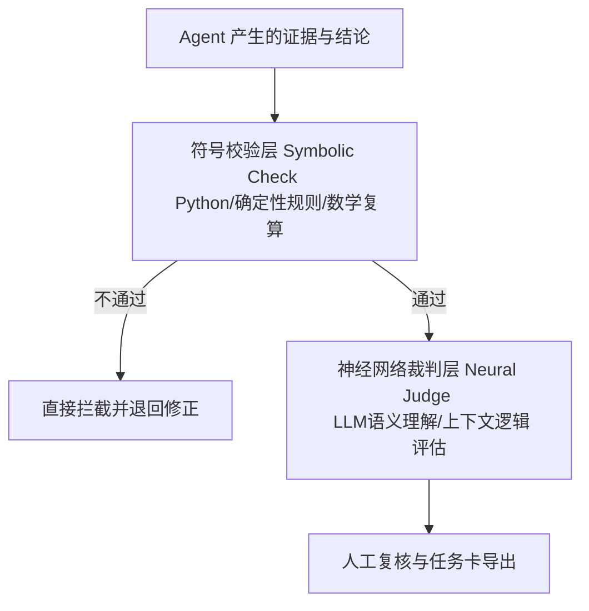

# 《审迹智链（AuditTrace）》项目计划书评审与修改建议报告

本项目计划书（风险控制版 V1.0）整体架构严密、逻辑清晰、定位精准。项目组敏锐地识别到了大模型在财会审计领域落地的真实痛点（合规风险、幻觉问题、证据链缺失、事后诸葛亮），并提出了切合实际的“T0/T1隔离回测”和“证据硬准入门槛”等设计。这在本科生竞赛中已经具备了非常高的成熟度。

为了让项目在决赛评审中脱颖而出（特别是争取“专业深度 25分”与“技术创新 25分”的高分段），特从以下五个维度提出深度优化与修改建议。

---

## 1. 效果评估维度：引入“反事实对照测试”以排除模型记忆污染（★ 核心创新建议）

> **[!IMPORTANT]**
> **痛点分析**：评审委员会中的“大数据与AI技术专家”极易提出一个尖锐质疑：“*虽然你们隔离了 T0/T1 文件，但 DeepSeek/通义千问等大模型在预训练阶段很可能已经学习过龙宇股份、金通灵等知名舞弊案的处罚决定书。模型可能不是基于 T0 资料推导出来的风险，而是直接通过公司名称检索到了其预训练记忆。*”

### 修改建议：
1. **设计“反事实对照组 (Counterfactual Control Group)”**：
   * 在评估方案中，增加一项**“去标识化与数字微调测试”**。
   * **测试方法**：将案例 A（如金通灵）的年报 PDF 或数据中的公司名称替换为虚拟名称（如“星际动力”），并将关键财务数据进行微减或微增（如将营收数字调整 3%~5%，但不破坏勾稽关系和异常趋势）。
   * **评估对比**：对比模型在“原版案例（带真实名字）”与“虚拟案例（去标识化）”下的风险识别输出。如果两者输出的风险类型、逻辑链条完全一致，则有力地证明了**系统是基于财务与业务逻辑进行实时推理，而非依赖模型的预训练记忆**。
2. **将此测试写入方案书的“效果评估”章节**，这将成为技术可行性和学术严谨性上的极大亮点，能有效说服技术评委。

---

## 2. 技术创新维度：升级“Agent-as-a-Judge”为“规则-神经网络混合裁判”

> **[!NOTE]**
> 计划书 5.1 节提到“确定性硬校验程序检查页码/公式，语义裁判智能体检查原文逻辑”。这种设计非常务实，但可以包装得更具学术和技术前沿感。

### 修改建议：
1. **提出“神经-符号融合裁判（Neural-Symbolic Hybrid Judge）”架构**：
   * 将大模型的语义理解（神经网络/Neural）与确定性的财务勾稽公式、禁用词规则库（符号逻辑/Symbolic）深度融合。
   * **逻辑设计**：符号校验（Python 脚本）拥有“一票否决权”。例如，如果质疑 Agent 提取的“应收账款周转率”计算公式在数学上不成立，或者对应的 PDF 页码在原文中检索不到，符号校验模块直接拦截，不进入 LLM 裁判。
   * 这种提法在学术界和工业界属于非常热门的 AI 范式，能极大提升“技术创新（25分）”的得分。

---

## 3. 专业深度维度：细化财务指标与审计认定的逻辑映射

> **[!TIP]**
> 计划书中提到“将异常连接到应收、存货、现金流和管理层认定”，但目前缺乏具体的映射逻辑。评委中的财会专家会非常看重系统如何从“指标异常”推导到“审计风险假设”和“审计程序”。

### 修改建议：
1. **建立《财务指标-舞弊假设-管理层认定-审计程序》映射矩阵**：
   建议在方案书中增加一个清晰的表格，向评委展示系统底层配置的“专业规则卡”逻辑。例如：

| 异常指标特征 | 触发的风险假设 (Skeptic) | 涉及的管理层认定 | 强制反证方向 (Defender) | 建议的审计程序 (审计任务卡) |
| :--- | :--- | :--- | :--- | :--- |
| 营业收入大幅增长，但经营性现金流背离；应收账款周转天数异常拉长。 | 虚构交易/缺乏商业实质的循环贸易风险 | **发生 (Occurrence)** **准确性 (Accuracy)** | 检查是否存在行业普遍性账期拉长（如大客户多为国企，回款慢但信用好）。 | 1. 针对前五大客户进行穿透函证； 2. 调取物流单据与海关出口数据进行三单匹配。 |
| 毛利率显著高于同行业平均水平，但研发投入或产品壁垒并不明显。 | 总额法与净额法混淆，或虚增收入空间 | **分类 (Classification)** **准确性 (Accuracy)** | 检查是否因销售模式转变（如直销比例提高、原材料代加工模式）。 | 1. 抽查重大销售合同中关于商品控制权转移的条款； 2. 判断公司是主要责任人还是代理人。 |

---

## 4. 落地可行性维度：增设“数据预检与清洗智能体”以应对现场提问

> **[!WARNING]**
> 决赛现场评委常常会问：“如果我现场给你们一个全新的、没有经过预处理的上市公司年报 PDF，系统还能跑吗？解析会报错吗？”虽然计划书明确写了“不在现场临时分析未经过合规检查的公司”，但需要给出一个更积极的技术防御方案。

### 修改建议：
1. **设计“数据预置与合规预检智能体 (Data Pre-flight Agent)”**：
   * 在 Web 原型的上传入口处，增加一个自动化的“数据健康度检查”流程。
   * 当用户上传任意 PDF 时，系统首先自动检查：
     * PDF 是否为双层可检索文本（非扫描纯图片，如为图片则提示需要 OCR 预处理）；
     * 关键财务三表（资产负债表、利润表、现金流量表）的表格抽取完整度；
     * 进行基础财务勾稽测试（如：资产是否等于负债加所有者权益，净利润是否与明细对齐）。
   * 如果预检通过，显示“健康度 95%，可以开始分析”；如果勾稽不对，自动标红提示“第 X 页表格解析存在偏差，建议人工校对”。
   * **价值**：这把“无法保证任意 PDF 解析成功”的工程局限，转化为了一个极具专业度的主动防护功能——“财报数据安全隔离与预检”。

---

## 5. 展示与材料维度：突出“对比基线 (B0-B3)”的直观差异（5分钟视频建议）

> **[!TIP]**
> 计划书 9.1 节设计了 B0 到 B3 的对比，但在 5 分钟视频和答辩 PPT 中，如果只是放一张复杂的表格，评委很难在几秒钟内看懂。

### 修改建议：
1. **在演示视频中设计“同屏对比（Split-screen Demo）”**：
   * **画面左侧**：展示“通用大模型 (B1)”直接读取年报的效果。展示其给出的宽泛、模糊、没有页码支撑的回答，甚至包含幻觉数字（用红字标出）。
   * **画面右侧**：展示“审迹智链 (B3)”的分析过程。展示其精准定位到第 124 页的特定段落，经过反证 Agent 质疑，符号校验通过，最终生成包含清晰核查程序的审计任务卡（用绿字标出）。
   * **效果**：这种直观的视觉冲突能够瞬间让评委理解多智能体架构和硬校验的必要性，极大强化“效果评估（15分）”和“演示视频（10分）”的得分。

---

## 总结与建议行动项

这份计划书的架构已经非常扎实，修改的重点不在于推倒重来，而在于**“技术概念的学术化包装”**和**“评估方法论的无懈可击化”**。

建议队长与队员在接下来的协作中：
* **由队员 B** 尝试设计“反事实对照测试”的去标识化案例数据，验证模型在匿名情况下的表现；
* **由队员 A** 细化《财务指标-舞弊假设-管理层认定-审计程序》映射矩阵；
* **由队长** 在 Streamlit 原型设计中，加入“数据预检（Data Pre-flight）”的前端交互和“符号-神经网络裁判”的日志输出逻辑。
