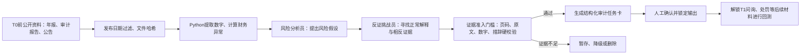

先说结论：**“财务舞弊”值得定题，但原来的范围和表述必须收窄。**

我最终建议的题目是：

> **《审证链（AuditTrace）——基于监管案例时间回测与证据链约束的上市公司收入舞弊风险线索智能体》**
>
> 副标题：面向审计业务承接与风险评估阶段的公开信息预筛查工具

首版只聚焦三类当前监管重点：

- 空转走单、虚假贸易；
- 滥用总额法虚增营业收入；
- 提前或延后确认收入。

这三类问题正是证监会2026年财务造假专项行动明确关注的方向。证监会披露，前两轮专项行动共处理263起案件线索、作出107起行政处罚决定，重点就包括虚假贸易、总额法和收入确认时点问题，说明选题具有现实性，不是过时课题。[证监会2026年专项行动](https://www.csrc.gov.cn/csrc/c100028/c7628221/content.shtml)

但产品绝对不能叫“自动识别造假”或“判定舞弊”。正确定位是：

> 根据上市公司公开资料，发现可能导致重大错报的风险线索，说明证据、正常解释、尚缺资料和下一步审计程序。

财政部审计准则也明确，注册会计师并不负责从法律角度认定舞弊是否实际发生。[审计准则第1141号](https://kjs.mof.gov.cn/zhengcefabu/201904/P020190409588122375265.pdf)

## 一、为什么公开数据足以支撑这个题

老师担心“没有企业内部数据，会不会无法落地”，这个担心有道理，但可以通过改变业务场景解决。

你们不做“企业内部审计执行工具”，而是做：

> 会计师事务所在承接客户、续约或编制审计计划前，利用公开资料进行风险预筛查。

中注协2025年发布的《运用信息技术识别与应对舞弊风险》明确提出，在业务承接前可以收集财务报表、经营数据、公告、工商信息、舆情、司法征信等公开数据，建立分行业指标体系和AI模型；还专门举例收入、应收账款和货币资金的三维分析。这几乎就是本项目业务场景的官方依据。[中注协第19号问题解答](https://www.cicpa.org.cn/xxfb/tzgg/202501/W020250123527074489975.pdf)

公开资料可以发现“线索”，例如龙宇股份2022年原始年报披露：

- 商业销售收入占主营业务收入96.50%；
- 商业销售毛利率只有0.54%；
- 前五大客户占47.58%；
- 前五大供应商占54.73%；
- 营业收入约99.84亿元，经营现金流量净额约0.42亿元，后者仅相当于收入的约0.42%。

这些不能单独证明舞弊，却足以触发对交易实质、总额法、客户供应商关系和资金流的审计程序。[龙宇股份2022年年报](https://static.cninfo.com.cn/finalpage/2023-04-28/1216645157.PDF)

后来监管部门正式认定，该公司2019—2022年通过虚构贸易链条、人为增加业务环节等方式开展虚假贸易，2022年虚增营业收入约42.88亿元，占当期披露营业收入42.95%。[龙宇股份行政处罚决定](https://www.csrc.gov.cn/shanghai/c103864/c7595870/content.shtml)

这正好证明：

> 公开数据无法完成最终定案，但确实可能提前暴露值得深入核查的风险线索。

## 二、真正有竞争力的创新点

原来“多智能体对抗辩论”本身不够新。技术评委很可能追问：为什么不让一个大模型多思考几次？

研究已经发现，多智能体辩论并不稳定优于单智能体、自洽采样等简单基线；长时间自由辩论还可能偏离问题。[多智能体辩论系统评估](https://proceedings.mlr.press/v235/smit24a.html)、[MAD系统性评估](https://arxiv.org/abs/2502.08788)

所以创新点应当改成以下四项。

### 1. “穿越前”时间回测

对每个历史案件设置分析截止日T：

- 系统只能看到T之前已经公开的年报和公告；
- 后续问询函、差错更正、立案和处罚全部锁住；
- 系统先生成风险结果并保存哈希；
- 再解锁后续监管文件进行核对。

这比普通“拿处罚决定让AI总结舞弊原因”强很多，因为后者存在严重答案泄漏。

### 2. 证据准入门槛

不是让AI说得像专家，而是要求每一条风险必须带有：

- 文件名称；
- 公告日期；
- PDF页码和年报印刷页码；
- 原文片段；
- 使用的财务数字；
- 计算公式；
- 涉及的报表项目；
- 涉及的管理层认定，如“发生、截止、准确性”；
- 可能的正常解释；
- 尚未取得的证据。

页码、数字、发布日期或引用不正确，程序直接驳回。

### 3. 反证挑战，而不是自由辩论

“审慎辩护员”必须主动寻找正常解释，例如：

- 大宗贸易本来就可能高收入、低毛利；
- 经营现金流波动可能来自结算周期；
- 应收账款上升可能来自新增大客户；
- 客户集中可能符合行业特点。

只有风险假设经受住反证挑战后，才能进入正式报告。这体现的是审计中的职业怀疑和避免确认偏误，而不是为了展示而安排几个AI争论。

### 4. 从风险线索直接生成审计任务

系统不能止步于“应收账款异常”，而要生成可以真正执行的任务卡，例如：

> 对年末前十大客户实施积极式函证；对未回函项目检查合同、出库、签收及期后90日回款；核对合同主体、物流主体、开票主体和回款主体是否一致；检查公司在交易中是主要责任人还是代理人。

这部分能显著提升“专业深度”和“落地可行”评分。

## 三、完整系统流程

系统首版建议包括五个页面：

1. 案例选择与分析截止日；
2. 关键财务数字人工校验；
3. Top-5风险看板；
4. 证据链、正常解释和审计任务卡；
5. 历史回测与基线对比。

每家公司最多输出5条风险，避免把整份年报变成几十条无重点警告。

## 四、首版重点检查的风险

建议冻结八类规则，不要无限扩充：

1. 应收账款增速明显高于收入增速；
2. 收入增长但经营现金流持续恶化；
3. 收入规模很大但毛利率异常低，需检查总额法；
4. 毛利率突然变化且与历史或行业明显不一致；
5. 存货增速明显高于收入增速；
6. 应收账龄恶化，但坏账准备覆盖率下降；
7. 前五大客户或供应商集中度突升；
8. 收入政策、新业务模式、审计意见或事务所发生重大变化。

这些规则由程序计算，大模型只负责解释和形成核查程序，不能让大模型自己“心算”财务数字。

## 五、需要收集的数据

### 1. 每个案例的T0输入资料

必须收集：

- 涉事年度原始年报，不使用后来修订版本代替；
- 前2—3年的年报；
- 审计报告及关键审计事项；
- 内部控制评价报告、内控审计报告；
- 截止日以前已经发布的重大合同、关联交易、担保等公告；
- 当时已经公开的行业对比数据；
- 文件发布日期、原始URL和文件哈希。

关键财务字段：

- 营业收入、营业成本、毛利率；
- 应收账款、合同资产、合同负债；
- 存货及跌价准备；
- 经营活动现金流；
- 净利润、利润总额；
- 预付款、其他应收款；
- 前五大客户、供应商及集中度；
- 分行业、分产品收入和毛利；
- 审计意见、关键审计事项、事务所变更；
- 收入确认政策、总额法/净额法说明。

### 2. T1答案资料

只用于评价，不能进入模型输入：

- 交易所问询函；
- 公司回复及会计师专项说明；
- 差错更正公告；
- 立案公告；
- 最终行政处罚决定；
- 纪律处分；
- 后续年报中对案件的说明。

### 3. 标签必须分层

不能简单分成“舞弊/不舞弊”。

| 标签               | 正确含义                             |
| ------------------ | ------------------------------------ |
| 最终处罚确认       | 监管部门最终文件已经明确认定         |
| 监管关注           | 交易所问询，不能等同于舞弊           |
| 差错更正           | 存在会计差错，不一定属于故意舞弊     |
| 非标审计意见       | 审计证据或报表存在问题，不等同于舞弊 |
| 立案调查中         | 尚未形成最终认定                     |
| 截止日未见公开认定 | 未标注对照样本，不能称为“正常公司” |

“没有被处罚”不等于“没有舞弊”，因此对照公司只能用于观察系统是否产生过多警报，不能计算传统意义上的“绝对误报率”。

### 4. 推荐样本规模

最低可交付：

- 8个已处罚公司年度；
- 8个同行业未标注对照公司年度；
- 3个固定演示案例。

比较理想：

- 12—16个已处罚公司年度；
- 12—20个同行业对照公司年度；
- 其中至少3个困难案例，而不是全部选择造假比例极高的著名公司。

## 六、推荐案例池

| 案例               | 用途                                               |
| ------------------ | -------------------------------------------------- |
| 龙宇股份           | 主演示；虚假贸易、低毛利大规模收入、客户供应商集中 |
| 金通灵             | EPC履约进度、提前确认收入、销售退回                |
| 卓朗科技           | 虚构服务器及系统集成业务、货物流与回款闭环         |
| 锦州港             | 虚假贸易、跨期确认收入、关联方资金占用             |
| 特发信息           | 并购子公司、业绩承诺压力、成本跨期和虚构销售       |
| 江苏舜天＋中利集团 | 同一专网通信闭环交易网络，必须作为同一组切分       |

一手案件材料包括：[金通灵处罚决定](https://www.csrc.gov.cn/jiangsu/c103902/c7454412/content.shtml)、[卓朗科技处罚决定](https://www.csrc.gov.cn/csrc/c101928/c7528626/content.shtml)、[锦州港处罚决定](https://www.csrc.gov.cn/liaoning/c103750/c7561555/content.shtml)、[特发信息处罚决定](https://www.csrc.gov.cn/shenzhen/c104320/c7491955/content.shtml)、[江苏舜天处罚决定](https://www.csrc.gov.cn/csrc/c101928/c7491450/content.shtml)、[中利集团处罚决定](https://www.csrc.gov.cn/csrc/c101928/c7491493/content.shtml)。

紫晶存储、康美药业等著名案件可以用来检查系统是否能正常运行，但不适合当作主要效果证明，因为大模型很可能已经记住了案件答案。

## 七、效果评估怎么做

必须比较相同资料、相同模型、相近调用次数和Token预算下的方案：

- B0：固定财务规则、Beneish M-score或Dechow F-score；
- B1：单个大模型直接分析年报；
- B2：单大模型＋同一知识库＋结构化证据模板；
- B3：与完整系统等调用成本的多次独立分析；
- B4：风险识别＋反证挑战＋证据准入＋任务卡的完整系统。

Dechow F-score等传统模型已经可以根据公开财务变量预测错报风险，因此不能把“能够计算异常指标”本身说成创新，只能把它作为基线。[Dechow等F-score研究](https://papers.ssrn.com/sol3/Delivery.cfm/SSRN_ID1615016_code337840.pdf?abstractid=997483)

核心指标建议为：

| 指标                           |         建议目标 |
| ------------------------------ | ---------------: |
| 关键数字抽取准确率             |            ≥95% |
| 引用页码正确率                 |            ≥90% |
| 通过硬校验后的无依据高风险结论 |              0条 |
| Top-5可观察监管事项覆盖率      |            ≥70% |
| 审计任务可执行性教师评分       |            ≥4/5 |
| 单个预处理案例运行时间         |           ≤90秒 |
| 同一案例重复运行稳定性         | 线索集合高度一致 |

样本量较小时，应同时报告“识别了几项/总共几项”，不要只展示漂亮百分比，更不要夸大统计显著性。

如果完整多智能体方案没有优于单智能体＋结构化模板，就应主动删掉多余角色。这样的结论反而显得项目严谨，不是失败。

## 八、最可能出现的问题

| 问题                                 | 解决办法                                                           |
| ------------------------------------ | ------------------------------------------------------------------ |
| 后续处罚材料泄漏进输入               | 按实际发布日期过滤，T0和T1分库存储                                 |
| 大模型记住知名案件                   | 隐藏公司名称与代码；进行“无文档记忆测试”；用较新的案件作最终测试 |
| 公开资料无法证明虚假合同或资金闭环   | 输出“证据缺口＋需要实施的审计程序”，不作最终认定                 |
| 多个智能体使用同一模型，错误高度相关 | 给角色不同数据和工具；只做一轮挑战；与等成本单智能体比较           |
| LLM裁判偏爱更长或更靠前的答案        | 数字和页码由程序判断；交换双方顺序复判；关键样本由老师人工评分     |
| PDF表格错位、单位误判                | 关键数字必须有人工确认页；保存单位、口径和原文页码                 |
| 问询函被误当成舞弊标签               | 标签单独设置为“监管关注”                                         |
| 对照公司其实也可能存在未发现问题     | 称为“观察窗内未见认定的对照样本”                                 |
| 只选择极端成功案例                   | 加入特发信息等困难案例；公布失败和不可观察事项                     |
| 范围越来越大                         | 首版只做收入循环、最多8类规则、每家公司最多5条风险                 |
| 输出损害公司名誉                     | 只引用最终官方文件；统一使用“风险线索”；不展示个人住址等信息     |
| API或现场网络故障                    | 内置3个缓存案例；确定性规则离线可运行；准备明确标注的备用录屏      |
| Vibe Coding生成代码不可复现          | 保存依赖、模型版本、提示词版本和测试记录；在另一台电脑完整启动一次 |

## 九、Vibe Coding与Python怎么处理

老师的意思不应该理解为“完全不用Python”。

[竞赛手册](/C:/Users/张宏博/Desktop/大二下/大二(1)/附件1北京市大学生数智会计创新应用竞赛手册.docx)明确写了主编程语言为Python 3.10以上，同时允许Claude Code、Vibe Coding等AI辅助编程。

最合适的结构是：

- Trae：用Vibe Coding完成开发、调试和迭代；
- Coze：展示可视化智能体工作流；
- Python：负责数字计算、时点过滤、引用验证和禁止措辞检查；
- Streamlit：做Web界面；
- SQLite：保存案例、财务事实、证据和运行记录；
- 国产大模型：负责文本理解、反证分析和任务生成。

这样既不是传统的“只写一个Python脚本”，也满足竞赛技术规范。Vibe Coding是开发方式，不应包装成项目的专业创新点。

## 十、从现在到初赛的执行安排

竞赛手册中方案书截止到9月25日，而原型评审安排紧接在9月25—30日，五天显然不足以从零开发。因此最稳妥的做法是把**9月20日作为内部原型完成日**。

| 时间          | 工作                                       |
| ------------- | ------------------------------------------ |
| 7月14—20日   | 完成可行性闸门、收集6个案例、人工标注2个   |
| 7月21—8月3日 | 完成风险知识卡、数据字段和8类规则          |
| 8月4—17日    | 完成PDF解析、事实表、时间过滤和异常计算    |
| 8月18—31日   | 完成Coze工作流、证据校验和Streamlit页面    |
| 9月1—10日    | 扩充案例，运行单智能体、规则和完整系统对比 |
| 9月11—20日   | 修复错误、异机测试、完成方案书和视频       |
| 9月21—25日   | 只做提交检查和备用材料，不再增加新功能     |

## 十一、定题前的一周“生死测试”

不要现在直接投入两个月。先用一周验证四件事：

1. 收集龙宇、金通灵、卓朗、锦州港、特发信息等至少5个完整案例；
2. 从其中2份原始年报人工标出财务异常、原文页码和后续监管事项；
3. 测试年报关键数字提取和页码回查；
4. 让单个大模型仅使用T0资料分析，再检查是否产生有证据的线索。

达到以下条件就正式定题：

- 至少5个案件能取得“原始年报＋最终处罚”；
- 至少3个案件在处罚前公开资料中存在可解释的风险线索；
- 关键数字与页码识别准确率达到90%以上；
- 能把至少3条风险转化成具体审计任务；
- 不依赖付费数据库也能完成核心演示。

如果达不到，就把题目进一步收窄为：

> “上市公司收入确认重大错报风险预筛查智能体”

弱化“舞弊”，重点保留证据链和审计程序生成。

最终判断：**这个题可以选，而且经过上述收窄后，是目前你们几个候选题中最有竞争力的一个。**但最有价值的不是“多个AI互相争论”，而是：

> **在不偷看答案的情况下，从公开年报发现风险；每个判断都能回到原文；系统主动寻找正常解释；最后给出会计师真正能执行的核查任务。**

这才是评委容易认可的创新、贡献和落地性。
