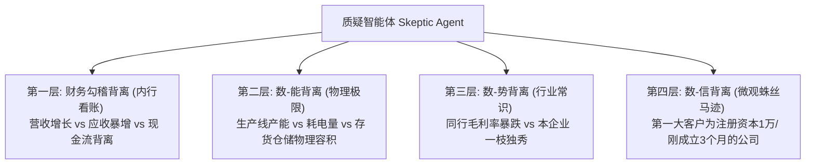

# 《审迹智链（AuditTrace）》——指导老师意见深度解析与应对策略报告

指导老师的这三点意见切中要害，触及了数智财会竞赛中最核心的**“业务场景真实性”**与**“技术应用价值门槛”**。以下针对这三点意见进行深度拆解，并提出具体的系统设计对策。

---

## 一、 关于受众定位与数据局限性（回应意见 1 & 2）

> **老师的质疑**：如果定位是给审计师，审计师在现场能拿到的内部资料（账套、凭证、函证、流水）比系统多得多，公开资料分析对他们显得太单薄。如果定位是给普通投资者，他们看不懂专业术语，如何引导提问？

### 我们的对策：精确定位为“事务所前置性风控人员”与“投行/买方尽调分析师”

我们可以把受众锁定在这两个极具痛点、且**同样面临公开数据局限性**的专业群体：

1. **事务所的前置风控岗（业务承接与续约评估人员）**：
   * **痛点**：在正式签约项目、进驻现场之前，审计项目组**没有权利**调取企业的内部账套、流水和合同。他们和普通投资者一样，**只能看公开资料**。
   * **业务逻辑**：根据执业准则，事务所必须在承接业务前评估客户的诚信风险和重大错报风险，以决定是否承接、如何定价。
   * **价值**：系统在此阶段替代人工快速扫描数年年报及监管信息，输出《业务承接风险预评估报告》，这完全符合审计的“承接/计划阶段”合规要求。

2. **投行/买方尽调分析师（证券分析师、做空机构研究员）**：
   * **痛点**：他们面临着严重的“信息不对称”，无法获取内部数据，但需要对上市公司进行深度排雷。
   * **价值**：提供专业级、基于审计逻辑的排雷工具，辅助投资决策。

### UI与交互上的引导设计调整：

如果主要受众是**专业风控/分析师**，我们保留目前的专业术语（如“管理层认定”、“审计任务卡”）；但为了兼顾“可能不懂深奥审计的普通分析师/投资者”，系统可增设**“白话提问引导模块”**：

* **白话提问层（前端交互）**：提供类似“大白话”的快捷提问按钮，如：“这公司的钱是真的赚到了吗？”、“它卖的东西会不会是假的？”、“是不是把明年的收入提前确认了？”。
* **审计逻辑翻译层（智能体路由）**：
  * “钱真的赚到了吗？” $\rightarrow$ 路由至 **【销售收现与应收账款背离分析（发生认定）】**
  * “卖的东西是真的吗？” $\rightarrow$ 路由至 **【产业链及行业毛利率异常对标（存在认定）】**
  * “是不是提前确认收入了？” $\rightarrow$ 路由至 **【跨期截止测试与合同资产异常分析（截止认定）】**
* 这种设计既展示了**专业底蕴**，又体现了**用户体验的易用性**。

---

## 二、 外部视角（外行）甄别财务舞弊的底层逻辑（回应意见 3）

> **老师的洞察**：很多舞弊是由非财务领域的“外行”（做空机构、媒体、行业专家）发现的。因为他们不仅看账面平衡（造假账的人能把借贷做得很平），而是看**财务数据与业务常识、行业趋势、物理事实的背离**。

这是一个极高水平的创新切入点。我们的**质疑智能体（Skeptic Agent）**的底层规则库必须从“纯财务指标对比”升级为 **“三源互证与业务常识背离的交叉检验”**。

### 质疑智能体（Skeptic Agent）的四层“外行视角”排雷逻辑设计：

### 具体的排雷规则与多智能体如何实现：

1. **数-能背离（物理常识与财务数据的背离）**：
   * **逻辑**：例如，农业/养殖业舞弊中，账面存货数量折算出的体积，超出了该公司拥有的仓库/农田物理面积；或者制造企业营收暴增，但年报附注披露的耗电量、机器折旧却基本没变。
   * **智能体设计**：由“业务常识智能体”根据行业数据换算物理空间/能耗比，对财务数据提出“合理性怀疑”。

2. **数-势背离（行业趋势与个体表现的背离）**：
   * **逻辑**：行业整体处于寒冬、大宗商品价格暴跌，但该公司毛利率逆势暴增，且无法用研发优势解释（研发费用极低）。
   * **智能体设计**：引入“行业基线智能体”检索同行业前三名龙头的数据，比对异常均值。

3. **数-信背离（披露细节与微观信息的背离 - 降维打击）**：
   * **逻辑**：年报中披露的前五大客户/供应商，通过大模型提取名字后，去外挂的工商数据库（模拟天眼查）查询，发现：
     * 成立时间极短（如刚成立 2 个月就成了几十亿订单的客户）；
     * 注册资本极低（如 1 万元的空壳公司）；
     * 社保缴纳人数为 0。
   * **智能体设计**：由“外部佐证智能体”专门解析年报附注的客户列表，模拟外挂工商背景审查。

---

## 三、 对我们项目的下一步行动建议

老师的话最后提到：“*边做可能也更能意识到存在的问题。*”

为了贯彻这一指导思想，建议项目组在开发第一版原型时，做以下调整：

1. **案例A（金通灵/龙宇股份）的数据深化**：
   不要只录入他们的三张财务报表，还要重点提取：
   * **年报附注中的前五大客户名称及关联方描述**；
   * **行业平均毛利率与同行业公司的对比数据**；
   * **公司生产能力、机器折旧及员工薪酬变动**。
   以此测试我们的质疑智能体能否通过“外行视角”（数-信、数-能背离）自动抓取到这些蛛丝马迹。

2. **在“修改建议.md”的基础上，将本报告的观点融入到即将撰写的初赛《项目方案书》的第一章（背景与意义）和第三章（问题定义与用户定位）中**。这能让方案书的立意站在极高的行业痛点和学术高度上。
