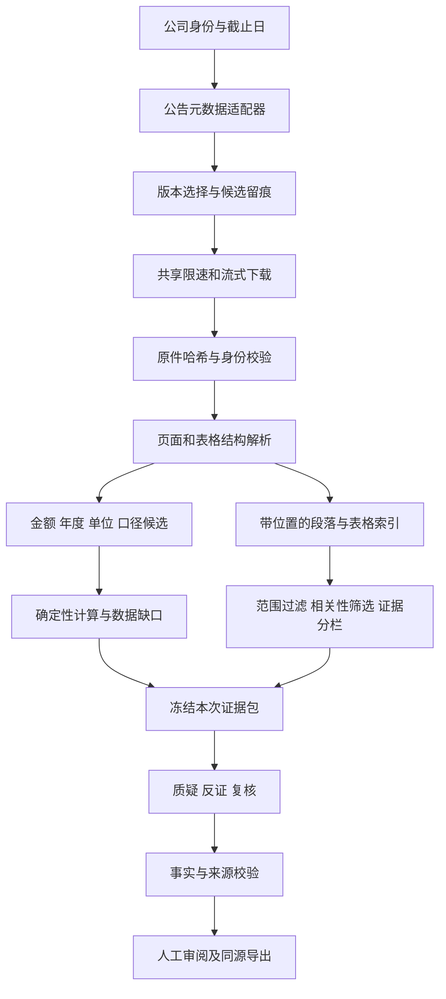

# 审迹智链代码与运行逻辑审查及开源对照优化方案

日期：2026-09-09。范围：当前工作区后端的巨潮采集、PDF 校验、字段提取、知识检索、导入任务和三角色分析编排。产物：代码审查、离线反例和实施建议；本轮未修改业务实现，未安装第三方项目，未提交或部署。

## 1 结论：先改数据链路，再改 Agent

建议优先投入三个方向：取得正确版本的资料、从正确单元格提取金额、只把相关证据送进模型。这些改进比增加 Agent 数量、扩大抓取量或整套替换 RAG 框架更直接。

当前系统并非所有逻辑都落后。它已经具备明确的公司隔离、PDF 哈希、来源快照、原子发布索引、字段候选与人工确认分离、模型事实校验，以及缓存和真实调用分开记录等设计。应保留这些约束。开源项目的功能描述不能证明它在本项目的中文年报和审计任务上表现更好，是否引入必须做同一资料集的对照。

本次查到了金融分析相似项目 FinRobot，以及可以分别借鉴的 AKShare、Scrapy、Docling、RAGFlow、LightRAG。建议采用小组件和设计思路，保留本系统的确定性事实层与专业边界。

## 2 证据范围与测试结果

本次直接读取了 cninfo.py、source_cache.py、field_extraction.py、knowledge_ingest.py、knowledge_sources.py、knowledge_rag.py、rag.py，以及 pipeline.py、main.py、agents.py、demo_run_tasks.py 的相关代码。没有逐行审计整个仓库，也没有执行新一轮线上抓取、真实模型链或开源框架性能测试。

现有三个相关测试文件实跑结果：**37 passed，1 warning，20.93 秒**。warning 为 Starlette TestClient 的 httpx 弃用提示，与下述逻辑缺陷不是一回事。通过的测试文件是 test_cninfo_pipeline.py、test_knowledge_sources.py、test_knowledge_sources_manifest.py。

另写了一个只构造内存夹具的反例脚本：[本次离线反例](review-assets/20260909_logic_probes.py)。从项目根目录运行：

```powershell
backend\.venv\Scripts\python.exe docs/review-assets/20260909_logic_probes.py
```

该脚本输出观察结果，不是修复后的通过测试，不触发真实网络或模型调用，不改业务资料。五项反例均已实际执行。

| 编号 | 反例 | 实际输出 | 结论与影响范围 |
| --- | --- | --- | --- |
| C01 | 本期应收 80，上期 120 | raw_value=120.0 | 自动字段候选选错；未证明已绕过后续人工或质量闸门 |
| C02 | 问“火星土壤化学组成”，只有审计抽样条目 | 返回 1 条 | 无关条目被包装为知识候选，可能占用证据和上下文预算 |
| C03 | 目标年度 2024，PDF 仅写 2022，同公司同代码 | passed，year_hit=false | 文档身份校验能放行错误年度 |
| C04 | 官方入口返回 application/pdf 头、HTML 正文和站外 final_url | ok=true | 多源资料评估函数没有守住其声明的校验边界；当前未发现它接入主路由的调用 |
| C05 | 巨潮请求返回 503，max_retries=2 | 实际仅请求 1 次 | 短暂服务故障没有按重试配置恢复 |

这些是受控边界反例，不是五份真实年报错误记录，也不能据此计算实际误报率。

## 3 必须优先修复的逻辑

### C01：数字大小不能代替表格列身份，P1

位置：backend/app/field_extraction.py:117 的 _line_candidates，特别是“小于等于 100 时把更大数字放在前面”的候选重排；_find_page_candidate 从候选中取第一个数字。

本期值 80、上期值 120 时，程序会为了排除附注号把 120 提到首位。真实企业以万元、百万元等单位披露时，小金额完全可能合法。即使数值很大，文本窗口法也不能可靠区分本期、上期、母公司、合并和其他相邻行。

修法：先建立行与列，再选择单元格。保留字段名、表名、合并/母公司口径、列标题、比较期间、原始字符串、单位、页面坐标、文档哈希和提取器版本。缺少列身份时返回歧义候选，不能靠“大数字优先”选值。附注列通过列头与坐标识别，不能仅按数值排除。

阶段实施：先取消会改变列序的大小启发式，并对歧义关闭自动采用；再用 PyMuPDF 的文字坐标或表格能力建立轻量解析器；复杂布局和扫描页才进入可选 Docling/OCR 路径。OCR 结果仍是候选。

验收至少涵盖：80/120、合法零值、负数、括号负数、附注列、单位“万元”、同页不同单位、母公司与合并报表、当前与比较列倒序。核对值与年度、单位、口径、来源坐标共同正确，不能只统计“抽到数字”。

### C03：公司、年度与文档类型必须分别成立，P1

位置：backend/app/cninfo.py:499 的 validate_pdf，当前将 name_hit、code_hit、year_hit、annual_hit 相加，满足三项即可通过。名称、代码和报告类型都命中时，年度缺失或错误仍能通过。

修法：企业身份为“名称或证券代码”，报告年度为独立必要条件，年度报告类型为另一必要条件。对扫描件或封面缺信息的文件标记 identity_unresolved，允许进入人工核验队列；不能用别的命中分数补齐缺失条件。

还要避免把正文里随便出现的四位数年份当成报告年度。优先封面、报告标题和明确的报告期间；比较列出现 2024 不等于整份报告属于 2024。保留判断依据和冲突字段。

验收：错误年度必拒绝或待核验；目标年份仅在比较列出现不得自动确认；同公司不同年份、不同公司同年份分别测试；旧快照保持可回溯。

### C02：先判断相关，再使用权威等级，P1

位置：backend/app/knowledge_rag.py:47、75、176。查询词来自 question_id、ticker、industry、case_id，未直接使用自然语言问题文本；排序把权威等级放在词命中之前，而且零词命中没有被剔除。limit=0 时仍用 max(1, limit) 返回至少一条，也应明确接口语义。

修法：query_text 与固定 question_id 分开存，固定问题 ID 映射到真实问题及受控同义词；先检查来源范围、时点、相关性和原文可追溯性，再在相关候选中比较权威性。权威材料、企业事实、背景材料使用不同结果分栏和配额，避免一类挤掉其他类。无有效命中返回 no_relevant_evidence。

条目只有标题或人工摘要时，必须标注来源目录候选；摘要哈希不能替代原文件哈希和原文片段哈希。禁止把该目录命中升级成已经检索过全文。

验证集增加无关问题、同公司无关主题、跨公司、截止日之后材料、仅标题相关但原文不支持的材料。使用真人标注的相关/不相关与支持/不支持两种标签，分别衡量检索质量和证据有效性。

### C04：统一下载和校验能力，P2，接入主链前须关闭

位置：backend/app/knowledge_ingest.py:44。只检查初始 URL，读取自动重定向结果后未再限制 final_url；期望 PDF 时依据 Content-Type 放行，没有检查 PDF 魔数与可解析性。MIN_DELAY_SECONDS 被声明，但函数没有执行相应节流；说明写 200MB，常量实际为 120MiB，文档也需要统一。

本次没有找到该函数被 backend/app 主业务路由调用，所以不把它描述成公开下载接口已经被利用。它属于接入新来源前必须补齐的基础设施缺口。

修法：和巨潮下载共享受控下载组件。每次重定向在发出下一跳请求前验证目标，限制次数和主机；检查真实字节、大小、PDF 可解析性，HTML 提取正文后判断是否是挑战页。网页导航有“登录”文字不应直接使正常公开正文失效。

### C05：重试需要按故障分类，P2

位置：backend/app/cninfo.py:293。已有间隔与指数等待，这是可保留的基础；当前重点处理 403/429 和网络异常，503 响应直接返回，没有进入重试。429 的 Retry-After 未被读取，403 和限流混为一类。

建议：只读下载与查询对网络瞬断、408、429、502、503、504 做有限重试；429 优先尊重 Retry-After，同时受任务总截止时间约束；其他可重试错误使用指数退避加随机抖动。403 进入访问限制分类，不反复冲击。POST 只有明确是无副作用查询的端点才允许自动重试，模型请求或业务写入不能复用同一策略。

重试日志记录状态码、原因码、次数、实际等待和终止原因。测试使用注入时钟与模拟响应，不真的等待一分钟，也不压测官方站点。

## 4 静态审查发现的结构风险

### 4.1 PDF 上限在全量读入之后才检查

cninfo.py:477 的 download_pdf 先通过非流式 request 获取 response.content，再判断体积。它限制的是已经收到的文件，不是接收过程的峰值。source_cache.py:79 已有边读边计数、写临时文件、增量哈希、成功后原子替换的实现，应优先抽取本项目已有能力，避免重新造第三个下载器。

建议两条路径共享下载器，并将后续解析接口从 bytes 逐步过渡到受控文件路径。只把下载改为流式、结束时又 read_bytes 整份读回，不能声称解决了全部内存问题。需要用超限流夹具验证及时停止，不做真实超大文件攻击测试。

### 4.2 分页和报告版本需要明确“完整”与“截至何时”

cninfo.py:361 查询有最大页数，遇到上限且 hasMore=true 时当前仍会返回已取得的候选；调用方难以判断是否截断。建议返回 fetched_pages、has_more、truncated 和查询条件，截断时不能宣称“最新版本已经完整核验”。

select_annual_report 选择最新有效公告，pipeline.py:971 再以选中公告的最大日期生成 latest_t0。这个逻辑适合“取最新可得资料”的模式；如果未来用于固定历史 T0 回测，需要由请求显式给出截止日，先过滤再选修订版。不能把现有“最新资料”路径直接当作“历史可得资料”路径。当前未证明已发生历史信息泄漏，属于两种模式的契约缺口。

建议保留文档原版和修订版，记录 announcement_id、published_at、report_period、content_sha256、supersedes。官方 URL 相同但内容哈希变化时新增版本，不静默覆盖。

### 4.3 节流只在客户端实例内

CNInfoClient 的 _last_request_at 是每个实例各自保存的；多个导入任务各创建客户端时，各自的一秒间隔并不等于全系统每秒一次。建议进程级按域名共享限速器和并发上限。多进程部署时再采用共享协调机制；不要为本机单进程演示先引入复杂分布式平台。

### 4.4 导入任务与演示任务采用不同执行方式

main.py:6022 附近的导入入口通过 BackgroundTasks 调度；demo_run_tasks.py 则已有独立任务执行器、幂等标识和 Supabase 租约相关能力。不是“系统完全没有任务管理”，而是需要统一可复用的任务协议。

建议统一任务状态、幂等键、阶段输入哈希、阶段产物和中断原因；导入任务增加可安全重入的检查点。下载或解析可以复用已验证产物；付费模型阶段必须确认之前调用是否已完成，不能遇到断连就自动重放。当前免费 Web 的运行中断边界继续如实保留。

### 4.5 年报检索可增量升级，不急着上知识图谱

rag.py:342 起使用确定性字符 n-gram 哈希向量；_retrieve_candidates 混合向量、关键词和主题锚点。这是轻量、可复现的基线，但它不是训练得到的语义嵌入。当前每次检索读取并反序列化 FAISS 索引，可按 case_id＋来源指纹＋索引版本做有上限的只读缓存，版本切换后失效。

先改结构化分块：表格不从中间切断，行块附带表头、单位和期间；再对比 BM25 或中文词项索引。需要语义召回时将中文嵌入作为候选策略，加小规模重排评测；不能直接把现有分数阈值套到另一种模型。每种策略都保留公司与截止日硬过滤，以及无证据拒答能力。

### 4.6 三 Agent 的依赖不能为了速度随意并行

agents.py:641—644 显示 Counter 读取 Challenge，Review 读取前两者，所以当前顺序有业务理由。建议优化每步拿到的证据包大小、重复说明和无关背景，而不是直接并行三个角色。

可以并行的是没有数据依赖的准备步骤，例如不同来源的候选元数据查询，但必须受全局限速控制。确定性计算继续由程序执行；模型负责对证据做受约束解释，不承担抓网页和补金额。

## 5 GitHub 项目对照与取舍

以下为本次查看官方仓库/文档所得；未克隆执行，没有以 star 数或 README 宣传证明效果。实施选型时须固定具体版本和提交并再次核对依赖、许可证与模型资源，不能直接追随 main。

| 项目 | 已核对的相关能力 | 可以借鉴 | 本项目的采用建议 |
| --- | --- | --- | --- |
| [AKShare](https://github.com/akfamily/akshare) | 官方文档列出巨潮公告查询接口，可按证券代码、类别与日期检索 | 企业与公告元数据适配，参数变更维护 | 做可选发现适配器或接口对照，不把返回的数据表当成已验证证据 |
| [Scrapy](https://github.com/scrapy/scrapy) | 独立重试中间件与按下载延迟调节速度的 AutoThrottle | 按主机调度、错误分类、重试和采集统计 | 目前先在 httpx 层补齐；扩大为长期多站批量采集后再评估整套接入 |
| [Docling](https://github.com/docling-project/docling) | 文档布局、阅读顺序、表格结构、OCR 与结构化导出 | 保留单元格、页码和文档结构 | 最值得做本地受控解析对照；复杂页按需启用，不直接塞入 Render 启动构建 |
| [RAGFlow](https://github.com/infiniflow/ragflow) | 文档解析、入库编排与 RAG/Agent 工作流，支持 Docling/MinerU 解析方式 | 把入库过程与回答过程拆开，检查解析结果后再检索 | 学流程与可观察性，暂不整体迁移服务架构 |
| [LightRAG](https://github.com/HKUDS/LightRAG) | 图结构检索、引用追踪和重排相关能力 | 引用与文档生命周期设计 | 作为后续对照；当前字段、相关性问题不需要先建知识图谱 |
| [FinRobot](https://github.com/AI4Finance-Foundation/FinRobot) | 财务数据接口、分析 Agent 和年报/研究报告生成案例 | data_source、分析、报告生成的职责分离 | 是相似金融分析项目，但投资研究目标不同；不引入估值、交易或投资建议逻辑 |

AKShare 的接口依据：[stock_zh_a_disclosure_report_cninfo 官方文档](https://akshare.akfamily.xyz/data/stock/stock.html)。本轮尝试读取一个推测的源码路径得到 404，因此不宣称已经核验它该函数的逐行实现。

Scrapy 的具体参考是 [AutoThrottle 文档](https://github.com/scrapy/scrapy/blob/master/docs/topics/autothrottle.rst)和[重试中间件源码](https://github.com/scrapy/scrapy/blob/master/scrapy/downloadermiddlewares/retry.py)。AutoThrottle 的延迟调节不能直接等同于已经支持所有 Retry-After 场景，后者仍是本项目需要明确实现和测试的策略。

Docling 的布局与表格能力见其[官方仓库](https://github.com/docling-project/docling)。在真实中文年报上是否优于当前提取器，本轮尚未测量。

## 6 建议的目标链路



对用户最有价值的新能力：输入公司和年度后，系统明确展示找到了哪一版年报、字段来自哪个单元格、哪里有歧义、哪些资料缺失，以及补一项资料会影响哪条待核查事项。抓取服务不直接产出“风险结论”，而是产出一套可检查的输入资料。

同时保留两条入口：冻结案例直接复用已核验快照；新企业走导入准备流程。现场演示不要每次从下载全文重新开始。已存在的增量 PDF 和目录缓存继续保留，补齐正确的版本键即可。

## 7 可执行任务表

| 优先级 / 任务 | 主要文件 | 交付与验收 |
| --- | --- | --- |
| P1 / T01 身份硬校验 | cninfo.py、对应测试 | 错公司、错年度、比较列年份和封面缺信息分别拒绝或待核验 |
| P1 / T02 字段歧义控制 | field_extraction.py、字段质量模块 | 80/120 反例关闭；不按金额大小改列序；歧义输出候选集合 |
| P1 / T03 检索相关性门禁 | knowledge_rag.py、问题配置与测试集 | 无关问题不强行返回；权威材料和企业事实分栏；query_text 生效 |
| P2 / T04 下载器统一 | cninfo.py、source_cache.py、knowledge_ingest.py | 流式限额、临时文件、逐跳校验和 PDF 解析一致；伪 PDF 反例关闭 |
| P2 / T05 网络调度 | 下载共享组件、cninfo.py | 503 可有限恢复、429 遵守等待、403 分类退出、多任务共享限速 |
| P2 / T06 公告版本与时点 | cninfo.py、pipeline.py、请求 Schema | 截断显式提示；历史截止日和最新模式分离；修订件可回溯 |
| P2 / T07 解析器对照 | 新的可选解析适配器、离线评测脚本 | 同一组表页比较轻量坐标提取与 Docling，不覆盖原候选 |
| P2 / T08 结构化检索与缓存 | rag.py、索引版本管理 | 表头不丢失；按版本失效；相同问题比较候选相关性与耗时 |
| P3 / T09 导入检查点 | pipeline.py、任务执行协议 | 重启可定位已完成阶段；相同输入不重复下载；不自动重放不确定付费调用 |
| P3 / T10 模块职责整理 | main.py 中导入与分析服务 | 路由仅处理请求/权限/响应，业务编排移到服务层；原 API 合同回归 |

先完成 T01—T03 的局部修复和反例回归，再做 T04—T06；T07—T08 先实验，效果明确后接入。不要同时重写抓取、RAG、Agent 和前端，否则难以判断改进来自哪里。

## 8 怎么判断改进真的有效

建立小而覆盖关键边界的固定评测资料集，建议从现有 15 案挑出 6 类页面：标准表格、附注列、万元或百万元、跨页表、母公司与合并并存、扫描/异常页。不得把程序自己的当前输出当作标准答案。

人工核对字段记录包括金额、期间、单位、口径、文档与页码；每个解析器输出保留原值和候选状态。报告“正确率”和“自动覆盖率”两项，不能靠拒绝所有输入换取看起来很高的准确率。

抓取指标：按公告唯一标识统计候选选择正确性、版本命中、缓存复用、请求次数、网络错误类型、下载字节和峰值内存。失败或限流计入分母，热缓存与冷启动分开。

检索指标：人工标注的 Recall@k、Precision@k、无关问题拒答率、引用可定位率；截止日和公司隔离按硬性错误单列。用于调阈值的开发集与最终测试集分开。

模型指标：相同事实快照和问题下比较证据支持情况、数字一致性、遗漏、Token 成本和时延；缓存和新调用分开。没有新鲜人工评分时只报告工程事实，不报告审计效果提升。

本轮只复现了边界缺陷并验证既有相关测试，未执行上述真实资料集对照。后续上线前仍需本地运行、代表性端到端验证及用户已有发布授权流程。

## 9 本轮保留与未做事项

保留工作区既有的 styles.css、index.html 和 check_frontend_contract.mjs 改动。本轮只新增本报告与离线反例脚本，没有改变人工签字、模型供应商、费用额度或冻结案例数据。

未修改缺陷实现，未安装或运行外部仓库，未做真实网站负载测试，未发生新的付费模型调用。开源资料是技术对照，不是实际性能结论。统一专业边界：AI生成内容，仅供审计计划阶段进一步核查，不构成审计结论或审计意见。

## 10 实施结果（2026-09-09 当日回填）

本节由实施轮追加。T01—T06 与两处结构风险已按计划 `docs/superpowers/plans/2026-09-09_数据链路缺陷修复实施计划.md` 完成并复验，实施详情与偏差以该计划和 `PROJECT_STATUS.md` 的 2026-09-09 段为准。

**对本报告自身结论的四处更正：**

1. **C01 比本报告写得更严重。** 原文写"未证明已绕过后续人工或质量闸门"。实测：错误值经 `calculation_ready_financial_rows` 返回为 `passed_technical_candidate` 且 `candidate_quality_issues=[]`，而 R1 必需字段正是 `accounts_receivable`。`cases.py` 的"原始值 ≤100 疑似附注号"与提取器的大小启发式**同源**，因此它拦住正确的 80、放行错误的 120，是反向加固。
2. **C02 比合成夹具更严重。** 线上 `question_id` 是 `KB-R1` 拼串，真实问题文本从未进入检索；在真实 13 条清单上返回的 8 条命中**词命中全部为 0**。相关性不是弱信号，而是当时完全不参与排序。
3. **C03 可利用面比原文窄。** `_normalize_announcement` 已按公告标题推断年度并丢弃不匹配候选，错年文件在上游多已被筛掉。仍须修的理由是记录失真：`year_hit=false` 时返回 `passed`，而错误文案声称已确认报告年度。
4. **C04 不是"缺口"而是死代码。** 该模块三个导出函数在 `backend/`、`scripts/`、`backend/tests/` 内均无调用方，`MIN_DELAY_SECONDS` 定义后从未被使用。已按"不删用户文件"处理：补边界、落实节流、修说明，并在模块与状态文件中明确标注"已实现未接入"。

**修复后实测：** `pytest backend/tests -q` **502 passed**（基线 456，新增 46 项缺陷回归）；中文注释 2582/25221 = **10.24%**；前端合同检查通过；复核脚本五项输出全部符合期望。知识检索测试集（26 题、k=5）"应拒未拒"由 HEAD 基线 11 条降至 6 条，"意外空"保持 0 条。

**仍然没有证据的部分：** 真实年报字段错误率、扫描件与复杂版式下的列身份识别率、剩余 6 条应拒未拒的相关性判定（需真人标注相关/不相关后才能收紧，不靠调阈值换取数字）、Docling 与轻量坐标提取在同一资料集上的对照、AKShare 发现适配器，均未实施或未测量。原 9/8 生成的检索测试集产物在本轮被中间态运行覆盖，已用 HEAD `155e3ad` 原始模块重跑重建为 `results_baseline_head_155e3ad.json`。

**未执行的动作：** 未 commit、未 push、未部署、provider 调用 0 次，未改动冻结案例清单、T0、baseline、发布记录与任何人工签字或评分字段。
